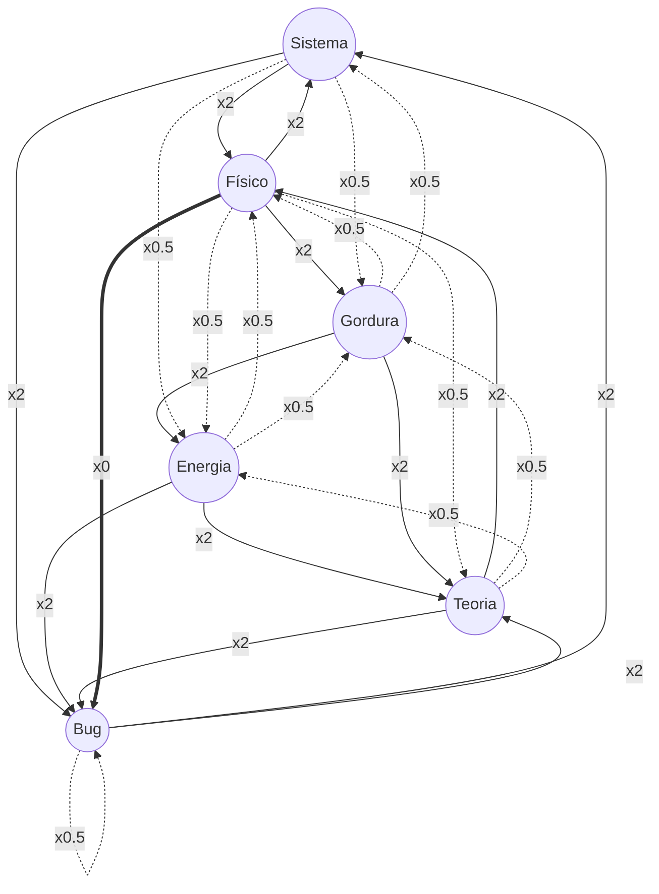

```mermaid
graph TD
    %% Definição dos Tipos
    S((Sistema))
    F((Físico))
    E((Energia))
    B((Bug))
    G((Gordura))
    T((Teoria))

    %% Relações Super Efetivas (x2)
    S -->|x2| F
    S -->|x2| B
    
    F -->|x2| S
    F -->|x2| G
    
    E -->|x2| T
    E -->|x2| B
    
    B -->|x2| S
    B -->|x2| T
    
    G -->|x2| E
    G -->|x2| T
    
    T -->|x2| F
    T -->|x2| B

    %% Relações Pouco Efetivas (x0.5)
    S -.->|x0.5| E
    S -.->|x0.5| G
    
    F -.->|x0.5| T
    F -.->|x0.5| E
    
    E -.->|x0.5| F
    E -.->|x0.5| G
    
    B -.->|x0.5| B
    
    G -.->|x0.5| F
    G -.->|x0.5| S
    
    T -.->|x0.5| G
    T -.->|x0.5| E

    %% Imunidades (x0)
    F ==>|x0| B
```